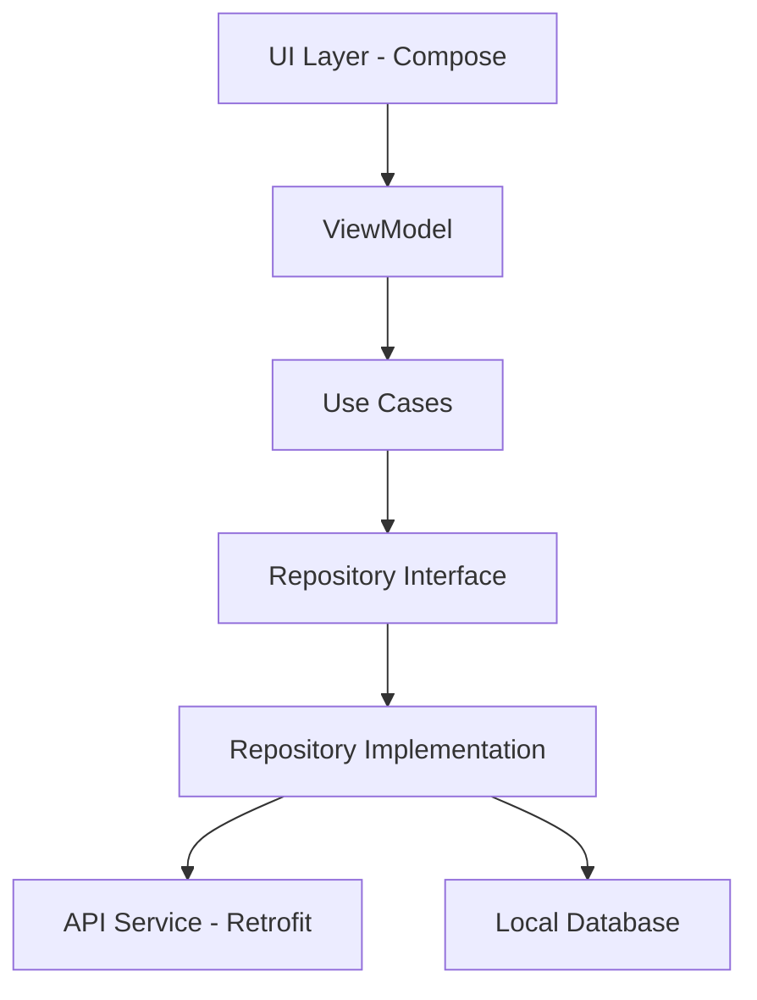

# 🚀 Android App Migration: From Spaghetti Code to Clean Architecture with Gemini AI

Una guía completa para migrar aplicaciones Android desde código desorganizado hacia una arquitectura limpia, escalable y bien testeada utilizando **prompts específicos de Gemini AI** y las mejores prácticas de Kotlin y Jetpack Compose.

## 📋 Tabla de Contenidos

- [Descripción del Proyecto](#descripción-del-proyecto)
- [¿Por qué usar Gemini AI para la migración?](#por-qué-usar-gemini-ai-para-la-migración)
- [Arquitectura Final](#arquitectura-final)
- [Tecnologías Utilizadas](#tecnologías-utilizadas)
- [Proceso de Migración Guiado por Prompts](#proceso-de-migración-guiado-por-prompts)
- [Estructura del Proyecto](#estructura-del-proyecto)
- [Configuración del Entorno](#configuración-del-entorno)
- [Cómo usar esta guía](#cómo-usar-esta-guía)
- [Testing](#testing)
- [Contribución](#contribución)

## 📖 Descripción del Proyecto

Este repositorio documenta el proceso completo de migración de una aplicación Android desde un estado de **código spagueti** hacia una **arquitectura limpia y escalable** utilizando **prompts específicos de Gemini AI** como guía paso a paso.

### 🎯 Objetivo Principal
Demostrar cómo utilizar **Gemini AI** de manera efectiva para:
- ✅ Refactorizar código legacy de manera sistemática
- ✅ Implementar **Clean Architecture** paso a paso
- ✅ Generar código idiomático y siguiendo mejores prácticas
- ✅ Crear tests unitarios e integración completos
- ✅ Migrar de XML Views a **Jetpack Compose**

## 🤖 ¿Por qué usar Gemini AI para la migración?

### Ventajas del enfoque guiado por IA:
- **🎯 Prompts específicos**: Cada paso tiene un prompt detallado y probado
- **📚 Contexto preservado**: Los prompts incluyen el contexto necesario del proyecto
- **🔄 Iteración rápida**: Generación de código base que luego se puede refinar
- **📖 Aprendizaje**: Los prompts sirven como documentación de mejores prácticas
- **⚡ Velocidad**: Acelera significativamente el proceso de migración

### Metodología:
1. **Prompt específico** para cada paso de migración
2. **Código generado** por Gemini con contexto completo
3. **Revisión y refinamiento** del código generado
4. **Testing** para validar la implementación

## 🏗️ Arquitectura Final

### Capas de la Aplicación

```
📁 app/
├── 📁 presentation/          # UI Layer (Compose, ViewModels)
│   ├── 📁 screens/
│   ├── 📁 components/
│   ├── 📁 viewmodels/
│   └── 📁 theme/
├── 📁 domain/               # Business Logic Layer
│   ├── 📁 models/
│   ├── 📁 repository/
│   └── 📁 usecase/
├── 📁 data/                 # Data Layer
│   ├── 📁 remote/
│   ├── 📁 repository/
│   └── 📁 dto/
├── 📁 di/                   # Dependency Injection
└── 📁 utils/                # Utilidades
```

### Patrón MVVM + Clean Architecture



## 🛠️ Tecnologías Utilizadas

### Core
- **Kotlin** - Lenguaje principal
- **Jetpack Compose** - UI moderna declarativa
- **Material Design 3** - Sistema de diseño

### Arquitectura
- **MVVM** - Patrón de presentación
- **Clean Architecture** - Separación de capas
- **Repository Pattern** - Abstracción de datos
- **Use Cases** - Lógica de negocio

### Inyección de Dependencias
- **Hilt/Dagger** - Inyección de dependencias

### Networking
- **Retrofit** - Cliente HTTP
- **Gson** - Serialización JSON
- **OkHttp** - Cliente HTTP subyacente

### Async & State
- **Coroutines** - Programación asíncrona
- **StateFlow** - Manejo de estado reactivo
- **Flow** - Streams de datos

### Testing
- **JUnit 4** - Framework de testing
- **MockK** - Mocking para Kotlin
- **ComposeTestRule** - Testing de UI Compose
- **Espresso** - Testing de instrumentación

## 🔄 Proceso de Migración Guiado por Prompts

### 📁 Paso 1: Código Base Inicial (`initial_codebase_step_1`)
**Preparación del proyecto base**

### 🔧 Paso 2: Configuración de Hilt (`initial_codebase_step_2`)

**🤖 PROMPT para Gemini:**
```
Necesito configurar Hilt para proveer la instancia de apiService en un paquete DI
Que clases debo crear y como puedo utilizar la instancia en mi Activity

Necesito configurar Hilt para que provea una instancia de ApiService (interfaz de Retrofit) desde un módulo ubicado en un paquete di.
1. Qué clases debo crear para esta configuración (por ejemplo, el módulo de red).
2. Cómo debe lucir el módulo Hilt (@Module, @Provides, etc.).
3. Cómo configurar Retrofit dentro del módulo (Retrofit.Builder, GsonConverterFactory, etc.).
4. Cómo puedo inyectar ApiService directamente en una Activity usando @Inject.
El proyecto no está configurado con Hilt (solo tiene los plugins en build.gradle).
Por favor, generar código completo, idiomático y listo para usar con buenas prácticas.
```

**📋 Resultado esperado:**
- Módulo de Hilt para networking
- Configuración de Retrofit
- Inyección en Activity

### 🏛️ Paso 3: Implementación del Repository (`initial_codebase_step_3`)

**🤖 PROMPT para Gemini:**
```
Quiero implementar el patrón Repositorio para realizar un llamado HTTP con Retrofit a una API inyectada mediante Hilt.
El método del repositorio no debe usar Flow, sino retornar directamente:

suspend fun getTodos(): Result<List<Todo>>

Requisitos:
* Utilizar Retrofit y Hilt (el ApiService ya está configurado y disponible por Hilt).
* Usar la clase Result de Kotlin (kotlin.Result), no una personalizada.
* Incluir manejo de errores realista con try/catch.

Además necesito:
1. Un DTO TodoDto que represente el objeto recibido desde la API.
2. Una función de extensión: fun List<TodoDto>.toDomainModel(): List<Todo> para mapear la lista del DTO al modelo del dominio.

Estructura esperada del proyecto:
* 📁 data:
    * Implementación concreta de TodoRepository
    * Clase TodoDto
    * Función de mapeo .toDomainModel()
* 📁 domain:
    * Interfaz TodoRepository
    * Modelo de dominio Todo (data class)

❌ No quiero que se cree el ViewModel todavía.
✅ El código debe seguir buenas prácticas de arquitectura limpia y ser idiomático de Kotlin.
✅ Debe ser completamente compatible con Hilt y Retrofit.
✅ Además, quiero un ejemplo claro de cómo inyectar y utilizar el repositorio en una Activity, sin usar ViewModel.
```

**📋 Resultado esperado:**
- Interface y implementación del Repository
- DTOs y mappers
- Manejo de Result<T>

### 🎯 Paso 4: Crear Casos de Uso (`initial_codebase_step_4`)

**🤖 PROMPT para Gemini:**
```
Quiero crear un caso de uso (UseCase) en Kotlin que:
* Llame al repositorio TodoRepository, el cual retorna: suspend fun getTodos(): Result<List<Todo>>
* Transforme los títulos (title) de cada Todo en mayúsculas (uppercase()).
* Devuelva el resultado como Result<List<Todo>>.

Estructura esperada:
* Clase GetTodosUseCase, ubicada en el módulo o paquete domain.usecase.
* Debe ser inyectable con Hilt usando @Inject.

También necesito:
* Un ejemplo de cómo utilizar el caso de uso directamente en una Activity, sin usar ViewModel por ahora.
* Debe ejecutarse en una corrutina (lifecycleScope.launch) y manejar el resultado de manera segura:
    * Mostrar los Todo si es Result.success.
    * Mostrar el error si es Result.failure.

✅ El código debe seguir buenas prácticas de arquitectura limpia, ser idiomático de Kotlin y compatible con Hilt.
```

**📋 Resultado esperado:**
- Use Case con lógica de negocio
- Transformación de datos
- Uso en Activity con corrutinas

### 🎨 Paso 5: ViewModel con StateFlow (`initial_codebase_step_5`)

**🤖 PROMPT para Gemini:**
```
Quiero crear un ViewModel que utilice un UseCase llamado GetTodosUseCase, el cual devuelve un Result<List<Todo>>. El ViewModel debe tener una función loadTodos() que invoque el caso de uso y exponga su estado usando un StateFlow con el siguiente modelo:

sealed class UiState<out T> {
    data class Success<T>(val data: T) : UiState<T>()
    data class Error(val message: String) : UiState<Nothing>()
    data object Loading : UiState<Nothing>()
}

private val _uiState = MutableStateFlow<UiState<List<Todo>>>(UiState.Loading)
val uiState: StateFlow<UiState<List<Todo>>> = _uiState.asStateFlow()

✅ El ViewModel debe utilizar viewModelScope.launch para ejecutar la carga.
✅ Debe manejar errores con try/catch y emitir UiState.Error en caso de excepción.
✅ En caso de éxito, debe emitir UiState.Success con la lista de Todo.

Además:
* Quiero que este ViewModel sea utilizado desde una Activity.
* La Activity debe observar el uiState y cargar los ítems automáticamente al iniciar.
* Puedes usar lifecycleScope.launchWhenStarted o una alternativa moderna y segura para observar el StateFlow.

🎯 El código debe seguir buenas prácticas de arquitectura limpia, ser idiomático de Kotlin y estar integrado con Hilt (el ViewModel debe ser anotado con @HiltViewModel y la Activity con @AndroidEntryPoint).
❌ No necesito ninguna vista en Compose. Quiero usar una Activity con layout XML clásico.
```

**📋 Resultado esperado:**
- ViewModel con StateFlow
- Estados de UI definidos
- Observación segura en Activity

### 🚀 Paso 6: Migración a Compose (`initial_codebase_step_6`)

**🤖 PROMPT para Gemini:**
```
Necesito migrar una aplicación Android de XML Views a Jetpack Compose. La aplicación actualmente usa Views tradicionales y necesito convertirla completamente a Compose manteniendo el mismo diseño y funcionalidad.
CONFIGURACIÓN GRADLE NECESARIA
En build.gradle.kts (app):

android {
    compileSdk = 35
    
    defaultConfig {
        minSdk = 25
        targetSdk = 35
    }
    
    composeOptions {
        kotlinCompilerExtensionVersion = "1.5.12"  // Compatible con Kotlin 1.9.23
    }
    
    buildFeatures {
        compose = true
    }
}

dependencies {
    // Compose BOM para versiones consistentes
    implementation(platform("androidx.compose:compose-bom:2023.10.01"))
    
    // Compose Core
    implementation("androidx.compose.ui:ui")
    implementation("androidx.compose.ui:ui-tooling")
    implementation("androidx.compose.foundation:foundation")
    implementation("androidx.compose.material3:material3")
    implementation("androidx.compose.material:material-icons-core")
    implementation("androidx.compose.material:material-icons-extended")
    
    // Activity Compose
    implementation("androidx.activity:activity-compose:1.8.2")
    implementation("androidx.lifecycle:lifecycle-runtime-compose:2.6.2")
    
    // Navigation y otros
    implementation("androidx.hilt:hilt-navigation-compose:1.1.0")
}
En versions.toml:

toml
[versions]
kotlin = "1.9.23"
compose = "1.5.4"
compose-material3 = "1.2.1"
activity-compose = "1.8.2"
lifecycle-runtime-compose = "2.6.2"

ARCHIVOS XML ORIGINALES A MIGRAR
colors.xml

<?xml version="1.0" encoding="utf-8"?>
<resources>
    <!-- Colores primarios -->
    <color name="primary">#3F51B5</color>
    <color name="primary_dark">#303F9F</color>
    <color name="primary_light">#C5CAE9</color>
    <color name="accent">#FF4081</color>

    <!-- Colores de estado -->
    <color name="green">#4CAF50</color>
    <color name="green_light">#C8E6C9</color>
    <color name="red">#F44336</color>

    <!-- Colores de texto -->
    <color name="text_primary">#212121</color>
    <color name="text_secondary">#757575</color>

    <!-- Colores de fondo -->
    <color name="background">#FAFAFA</color>
    <color name="surface">#FFFFFF</color>
    <color name="white">#FFFFFF</color>

    <!-- Colores grises -->
    <color name="gray">#9E9E9E</color>
    <color name="gray_light">#E0E0E0</color>
</resources>
item_todo.xml

<?xml version="1.0" encoding="utf-8"?>
<com.google.android.material.card.MaterialCardView
    xmlns:android="http://schemas.android.com/apk/res/android"
    xmlns:app="http://schemas.android.com/apk/res-auto"
    android:layout_width="match_parent"
    android:layout_height="wrap_content"
    android:layout_margin="8dp"
    app:cardCornerRadius="12dp"
    app:cardElevation="4dp"
    app:strokeColor="@color/gray_light"
    app:strokeWidth="0.5dp">

    <androidx.constraintlayout.widget.ConstraintLayout
        android:layout_width="match_parent"
        android:layout_height="wrap_content"
        android:padding="16dp">

        <ImageView
            android:id="@+id/statusIcon"
            android:layout_width="24dp"
            android:layout_height="24dp"
            android:src="@drawable/ic_check_circle"
            app:layout_constraintTop_toTopOf="parent"
            app:layout_constraintStart_toStartOf="parent"
            app:tint="@color/green" />

        <TextView
            android:id="@+id/todoTitle"
            android:layout_width="0dp"
            android:layout_height="wrap_content"
            android:layout_marginStart="12dp"
            android:layout_marginEnd="8dp"
            android:textSize="16sp"
            android:maxLines="3"
            android:ellipsize="end"
            app:layout_constraintTop_toTopOf="@id/statusIcon"
            app:layout_constraintStart_toEndOf="@id/statusIcon"
            app:layout_constraintEnd_toStartOf="@id/statusText" />

        <TextView
            android:id="@+id/statusText"
            android:layout_width="wrap_content"
            android:layout_height="wrap_content"
            android:textSize="12sp"
            android:textColor="@color/green"
            android:background="@drawable/status_background"
            android:paddingHorizontal="8dp"
            android:paddingVertical="4dp"
            app:layout_constraintTop_toTopOf="@id/statusIcon"
            app:layout_constraintEnd_toEndOf="parent" />

        <TextView
            android:id="@+id/todoId"
            android:layout_width="wrap_content"
            android:layout_height="wrap_content"
            android:layout_marginTop="8dp"
            android:layout_marginStart="36dp"
            android:textSize="12sp"
            android:textColor="@color/text_secondary"
            app:layout_constraintTop_toBottomOf="@id/todoTitle"
            app:layout_constraintStart_toStartOf="parent" />

        <TextView
            android:id="@+id/todoUserId"
            android:layout_width="wrap_content"
            android:layout_height="wrap_content"
            android:layout_marginStart="16dp"
            android:textSize="12sp"
            android:textColor="@color/text_secondary"
            app:layout_constraintTop_toTopOf="@id/todoId"
            app:layout_constraintStart_toEndOf="@id/todoId" />

        <View
            android:layout_width="0dp"
            android:layout_height="1dp"
            android:layout_marginTop="12dp"
            android:layout_marginStart="36dp"
            android:background="@color/gray_light"
            app:layout_constraintTop_toBottomOf="@id/todoId"
            app:layout_constraintStart_toStartOf="parent"
            app:layout_constraintEnd_toEndOf="parent" />

    </androidx.constraintlayout.widget.ConstraintLayout>
</com.google.android.material.card.MaterialCardView>
activity_main.xml

<?xml version="1.0" encoding="utf-8"?>
<androidx.constraintlayout.widget.ConstraintLayout
    xmlns:android="http://schemas.android.com/apk/res/android"
    xmlns:app="http://schemas.android.com/apk/res-auto"
    android:layout_width="match_parent"
    android:layout_height="match_parent"
    android:background="@color/background">

    <com.google.android.material.appbar.MaterialToolbar
        android:id="@+id/toolbar"
        android:layout_width="match_parent"
        android:layout_height="?attr/actionBarSize"
        android:background="@color/primary"
        app:title="Todo App"
        app:titleTextColor="@color/white"
        app:layout_constraintTop_toTopOf="parent" />

    <LinearLayout
        android:id="@+id/buttonLayout"
        android:layout_width="match_parent"
        android:layout_height="wrap_content"
        android:layout_margin="16dp"
        android:orientation="horizontal"
        app:layout_constraintTop_toBottomOf="@id/toolbar">

        <com.google.android.material.button.MaterialButton
            android:id="@+id/fetchButton"
            android:layout_width="0dp"
            android:layout_height="wrap_content"
            android:layout_weight="1"
            android:layout_marginEnd="8dp"
            android:text="Cargar Todos"
            android:textColor="@color/white"
            app:backgroundTint="@color/primary"
            app:icon="@drawable/ic_download" />

        <com.google.android.material.button.MaterialButton
            android:id="@+id/refreshButton"
            android:layout_width="0dp"
            android:layout_height="wrap_content"
            android:layout_weight="1"
            android:layout_marginStart="8dp"
            android:text="Actualizar"
            app:backgroundTint="@color/surface"
            app:icon="@drawable/ic_refresh"
            app:strokeColor="@color/primary"
            app:strokeWidth="1dp" />

    </LinearLayout>

    <androidx.recyclerview.widget.RecyclerView
        android:id="@+id/recyclerView"
        android:layout_width="match_parent"
        android:layout_height="0dp"
        android:layout_marginTop="8dp"
        app:layout_constraintTop_toBottomOf="@id/buttonLayout"
        app:layout_constraintBottom_toBottomOf="parent" />

    <com.google.android.material.progressindicator.CircularProgressIndicator
        android:id="@+id/progressBar"
        android:layout_width="wrap_content"
        android:layout_height="wrap_content"
        android:visibility="gone"
        app:layout_constraintTop_toTopOf="@id/recyclerView"
        app:layout_constraintBottom_toBottomOf="@id/recyclerView"
        app:layout_constraintStart_toStartOf="parent"
        app:layout_constraintEnd_toEndOf="parent" />

</androidx.constraintlayout.widget.ConstraintLayout>
RESULTADO ESPERADO
1. Estructura de archivos de tema:
Colors.kt

import androidx.compose.ui.graphics.Color

// Colores primarios
val Primary = Color(0xFF3F51B5)
val PrimaryDark = Color(0xFF303F9F)
val PrimaryLight = Color(0xFFC5CAE9)
val Accent = Color(0xFFFF4081)

// Estados
val Green = Color(0xFF4CAF50)
val GreenLight = Color(0xFFC8E6C9)
val Red = Color(0xFFF44336)

// Texto
val TextPrimary = Color(0xFF212121)
val TextSecondary = Color(0xFF757575)

// Fondos
val Background = Color(0xFFFAFAFA)
val Surface = Color(0xFFFFFFFF)
val White = Color(0xFFFFFFFF)

// Grises
val Gray = Color(0xFF9E9E9E)
val GrayLight = Color(0xFFE0E0E0)
Theme.kt

import androidx.compose.material3.*
import androidx.compose.runtime.Composable

private val LightColorScheme = lightColorScheme(
    primary = Primary,
    onPrimary = White,
    primaryContainer = PrimaryLight,
    secondary = Accent,
    onSecondary = White,
    background = Background,
    surface = Surface,
    onBackground = TextPrimary,
    onSurface = TextPrimary,
    error = Red,
    onError = White,
)

@Composable
fun TodoAppTheme(content: @Composable () -> Unit) {
    MaterialTheme(
        colorScheme = LightColorScheme,
        typography = Typography,
        content = content
    )
}
2. Composables principales:
TodoCard.kt - Basado en el ejemplo de migración exitosa que proporcionaste TodoScreen.kt - Screen principal con Scaffold, TopAppBar, etc.
REGLAS DE MIGRACIÓN
1. MaterialCardView → Card de Material3
2. ConstraintLayout → Column/Row/Box con modificadores apropiados
3. LinearLayout → Row/Column según orientación
4. TextView → Text con style de MaterialTheme.typography
5. ImageView → Icon cuando sea icono, Image para imágenes
6. MaterialButton → Button/OutlinedButton de Material3
7. RecyclerView → LazyColumn con items()
8. ProgressBar → CircularProgressIndicator
9. View (divider) → HorizontalDivider
10. Colores XML → Variables de Color.kt + MaterialTheme.colorScheme
SOLICITUD
Por favor, genera el código completo de migración mostrando:
1. Los archivos de tema (Colors.kt, Theme.kt, Typography.kt)
2. Los composables TodoCard.kt y TodoScreen.kt
3. Cómo integrar todo en MainActivity.kt usando setContent { }
Mantén las dimensiones exactas, colores y comportamiento del diseño original pero usando Compose moderno y Material3.
```

**📋 Resultado esperado:**
- Migración completa a Compose
- Sistema de temas con Material3
- Composables reutilizables

### 🧪 Paso 7: Testing Unitario de ViewModel (`initial_codebase_step_7`)

**🤖 PROMPT para Gemini:**
```
Necesito crear pruebas unitarias para mi TodosViewModel en Android usando MockK como librería principal de mocking junto con las herramientas estándar de testing de Android (JUnit, AndroidX Testing, Coroutines Test).

CONFIGURACIÓN DE DEPENDENCIAS REQUERIDA
[Incluye configuración completa de testing dependencies]

CÓDIGO DEL VIEWMODEL A TESTEAR
[Incluye código completo del ViewModel]

CASOS DE PRUEBA REQUERIDOS
Necesito que generes un archivo de pruebas unitarias TodosViewModelTest.kt que cubra:
1. Estado inicial
* Verificar que el estado inicial sea UiState.Loading
* Verificar que loadItems() se llame automáticamente en el init

2. Caso de éxito
* Cuando getItemsUseCase() retorna Result.success(itemsList)
* Debe emitir UiState.Loading → UiState.Success(itemsList)
* Verificar que los datos sean correctos

3. Caso de error del UseCase
* Cuando getItemsUseCase() retorna Result.failure(exception)
* Debe emitir UiState.Loading → UiState.Error(message)
* Verificar que el mensaje de error sea correcto

4. Caso de excepción
* Cuando getItemsUseCase() lanza una excepción
* Debe emitir UiState.Loading → UiState.Error(message)
* Verificar manejo del catch

5. Múltiples llamadas a loadItems()
* Verificar que cada llamada resetee el estado a Loading
* Verificar el comportamiento correcto en llamadas consecutivas

RESTRICCIONES TÉCNICAS
USAR:
* JUnit 4 para las pruebas
* MockK para crear mocks del UseCase
* InstantTaskExecutorRule para testing síncrono de StateFlow
* TestCoroutineDispatcher/UnconfinedTestDispatcher para testing de corrutinas
* runTest para testing de suspend functions
* coEvery y coVerify para mocking de suspend functions

SOLICITUD
Por favor, infiere y genera el archivo completo ItemsViewModelTest.kt que configure MockK correctamente, maneje las corrutinas apropiadamente y cubra todos los casos de prueba listados usando la estructura Given/When/Then.
```

**📋 Resultado esperado:**
- Tests unitarios completos del ViewModel
- Mocking con MockK
- Testing de StateFlow y corrutinas

### 🎯 Paso 8: Testing Básico de Compose (`initial_codebase_step_8`)

**🤖 PROMPT para Gemini:**
```
Necesito crear tests de instrumentación para probar un composable de Jetpack Compose usando ComposeTestRule. Los tests deben verificar que la UI se renderice correctamente y que los elementos sean accesibles.

CONFIGURACIÓN DE DEPENDENCIAS REQUERIDA
[Incluye configuración completa de UI testing dependencies]

CÓDIGO DEL COMPOSABLE A TESTEAR
[Incluye código completo del composable ItemCard]

CASOS DE PRUEBA REQUERIDOS
Necesito que generes un archivo de test de instrumentación ItemCardTest.kt que cubra:
1. Renderizado básico
* Verificar que el composable se renderiza sin errores
* Verificar que todos los elementos principales están presentes

2. Contenido del item activo
* Cuando item.isActive = true
* Verificar que muestra el ícono CheckCircle
* Verificar que el texto del status sea "Active"
* Verificar que el nombre del item se muestre correctamente
* Verificar que ID y Owner ID se muestren correctamente

3. Contenido del item inactivo
* Cuando item.isActive = false
* Verificar que muestra el ícono RadioButtonUnchecked
* Verificar que el texto del status sea "Inactive"
* Verificar colores y estilos apropiados

4. Interacción y accesibilidad
* Verificar que los elementos tienen contentDescription apropiados
* Verificar que los testTags funcionan correctamente
* Verificar que el contenido es accesible

5. Texto largo y overflow
* Probar con nombres muy largos
* Verificar que el ellipsis funciona correctamente
* Verificar que el layout no se rompe

HERRAMIENTAS DE COMPOSE TESTING A UTILIZAR
* composeTestRule.setContent { } - Para renderizar el composable
* onNodeWithTag() - Para encontrar elementos por testTag
* onNodeWithText() - Para encontrar elementos por texto
* onNodeWithContentDescription() - Para elementos con accessibility
* assertIsDisplayed() - Para verificar visibilidad
* assertTextEquals() - Para verificar texto exacto
* assertContentDescriptionEquals() - Para verificar accesibilidad

SOLICITUD
Por favor, infiere y genera el archivo completo ItemCardTest.kt que configure correctamente ComposeTestRule, use el tema apropiado para renderizar el composable y cubra todos los casos de prueba listados usando las herramientas de testing de Compose de manera eficiente.
```

**📋 Resultado esperado:**
- Tests de UI con Compose
- Validación de renderizado

## ⚙️ Configuración del Entorno

### Dependencias principales (build.gradle.kts)

- Cada paso inicial tiene configuradas las librerias

## 🚀 Cómo usar esta guía

### 1. **Prepara tu proyecto**
```bash
git clone https://github.com/tuusuario/TodoApp.git
cd TodoApp
```

### 2. **Sigue los pasos secuencialmente**
- Cada paso tiene su branch inicial correspondiente
  - initial_codebase_step_2
  - initial_codebase_step_3
  - initial_codebase_step_4
  - initial_codebase_step_5
  - initial_codebase_step_6
  - initial_codebase_step_7
  - initial_codebase_step_8

- La solución de cada paso esta en los branch:
  - final_codebase_step_2
  - final_codebase_step_3
  - final_codebase_step_4
  - final_codebase_step_5
  - final_codebase_step_6
  - final_codebase_step_7
  - final_codebase_step_8

- Usa el prompt exacto proporcionado con Gemini AI
- Revisa y adapta el código generado a tu proyecto específico

### 3. **Proceso recomendado por paso**:

#### Para cada paso:
1. **📖 Lee la descripción** del paso y sus objetivos
2. **🤖 Copia el prompt** exacto en Gemini AI
3. **⚡ Genera el código** con la IA
4. **🔍 Revisa y adapta** el código a tu contexto específico
5. **✅ Ejecuta los tests** para validar la implementación
6. **📝 Commitea los cambios** antes del siguiente paso

### 4. **Personalización**
- Adapta los prompts a tu dominio específico 
- Ajusta los colores y temas según tu diseño

## 🧪 Testing

### Testing Unitario
- **ViewModels**: Testing de estados, casos de éxito y error
- **Use Cases**: ❌ Falta Testing de lógica de negocio  
- **Repositories**: ❌ Falta Testing de llamadas de red y mapeo de datos

### Testing de UI
- **Composables**: Testing de renderizado y interacciones
- **Integración**: ❌ Falta Testing end-to-end de flujos completos 

### Estructura de Testing
```
app/src/test/java/                    # Unit tests
├── viewmodel/
├── usecase/
└── repository/

app/src/androidTest/java/             # Integration tests
├── compose/
└── ui/
```

## 🎯 Beneficios de usar Gemini AI

### ⚡ Velocidad de desarrollo
- **Generación rápida** de código boilerplate
- **Reducción del tiempo** de migración de semanas a días
- **Menos errores** humanos en implementación

### 📚 Aprendizaje acelerado
- **Prompts como documentación** de mejores prácticas
- **Código comentado** y bien estructurado
- **Patrones consistentes** a lo largo del proyecto

### 🔄 Iteración eficiente
- **Refinamiento rápido** del código generado
- **Experimentación segura** con diferentes enfoques
- **Validación inmediata** con tests generados

## 🎓 Lecciones Aprendidas

### ✅ Mejores Prácticas para Prompts
1. **Ser específico** con los requisitos técnicos
2. **Incluir contexto** del proyecto y arquitectura actual
3. **Especificar herramientas** y versiones exactas
4. **Pedir código completo** y funcional, no fragmentos
5. **Incluir casos de prueba** específicos

### ⚠️ Consideraciones importantes
- **Revisar siempre** el código generado por la IA
- **Adaptar** a las necesidades específicas del proyecto
- **Validar con tests** antes de integrar
- **Mantener consistencia** en el estilo de código

## 📚 Recursos Adicionales

- [Documentación oficial de Compose](https://developer.android.com/jetpack/compose)
- [Guía de arquitectura Android](https://developer.android.com/topic/architecture)
- [Hilt - Dependency Injection](https://developer.android.com/training/dependency-injection/hilt-android)
- [Testing en Android](https://developer.android.com/training/testing)
- [Prompting con Gemini AI](https://ai.google.dev/docs)

## 🤝 Contribución

¿Encontraste un prompt que funciona mejor? ¿Tienes mejoras para algún paso?

1. Fork el proyecto
2. Crea una branch para tu mejora (`git checkout -b mejora/prompt-step-X`)
3. Actualiza el prompt y documenta los cambios
4. Commit tus cambios (`git commit -am 'Mejora prompt del paso X'`)
5. Push a la branch (`git push origin mejora/prompt-step-X`)
6. Abre un Pull Request con descripción detallada

### 📝 Al contribuir, incluye:
- **Prompt original** vs **prompt mejorado**
- **Razón de la mejora** (mejor código, más específico, etc.)
- **Resultado obtenido** con el nuevo prompt
- **Capturas** si aplica

## 📝 Licencia

Este proyecto está bajo la Licencia MIT - mira el archivo [LICENSE](LICENSE) para más detalles.

## 👥 Autores

- **Pablo Miranda** - *Desarrollo inicial* - [@pabloWizeline](https://github.com/pabloWizeline)

**💡 ¿Tienes preguntas sobre algún prompt?** Abre un [issue](https://github.com/tu_usuario/android-migration-guide/issues) con la etiqueta del paso correspondiente.

**🤖 ¿Quieres mejorar un prompt?** ¡Contribuye! Cada mejora ayuda a todos.

**⭐ Si esta guía te ayudó a migrar tu app, no olvides darle una estrella ⭐**
